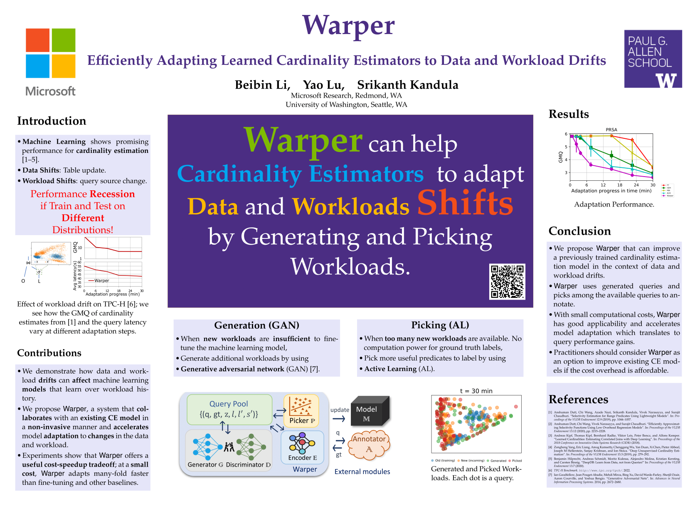

% Warper
% Beibin Li, Yao Lu, Srikanth Kandula
% Email: beibin.li@microsoft.com
<center>
 [[Paper PDF]](http://yao.lu/warper.pdf) 
 [[Talk Slides PDF]](Warper_slides.pdf)
 [[Talk Video]](https://youtu.be/JGtGurlP564)
 [[Poster HD PNG]](Warper_Poster_HD.png)
</center>





```
@inproceedings{li_warper_2022,
	title = {Warper: Efficiently Adapting Learned Cardinality Estimators to Data and Workload Drifts},
	booktitle = {Proceedings of the 2022 ACM SIGMOD International Conference on Management of Data},
	author = {Li, Beibin and Lu, Yao and Kandula, Srikanth},
	year = {2022},
}
```
